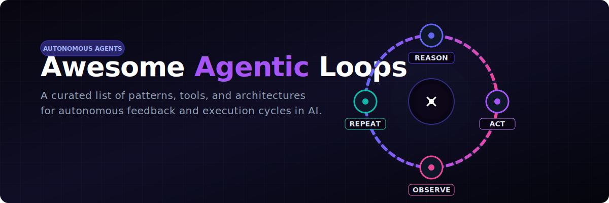

<p align="center">
  
</p>

<p align="center">
  <a href="https://github.com/ishandutta2007/Awesome-Awesome-Awesome"></a>
  <a href="https://github.com/ishandutta2007/Awesome-Agentic-Loops/stargazers"></a>
  <a href="https://github.com/ishandutta2007/Awesome-Agentic-Loops/network/members"></a>
  <a href="https://github.com/ishandutta2007/Awesome-Agentic-Loops/blob/main/LICENSE"></a>
  <a href="https://github.com/ishandutta2007"></a>
</p>

---

# 🤖 Awesome Agentic Loops in AI

A curated list of patterns, tools, architectures, and resources for building autonomous, self-correcting feedback cycles in Artificial Intelligence.

## 📖 Table of Contents
- [🔍 What is an Agentic Loop?](#-what-is-an-agentic-loop)
- [🏗️ Key Components](#️-key-components-of-an-agentic-loop)
- [🔄 Loop Architectures](#-loop-architectures)
- [⚠️ Best Practices & Pitfalls](#️-best-practices--pitfalls)
- [🤝 Contributing](#-contributing)

---

## 🔍 What is an Agentic Loop?

An **agentic loop** is the core autonomous execution cycle that powers AI agents. Unlike standard chatbots that respond to a single prompt and terminate, an agentic loop employs a **Reason ➔ Act ➔ Observe ➔ Repeat** cycle to autonomously decompose complex objectives, execute actions using external tools, verify outcomes, and self-correct until a defined goal is met.

```
   ┌────────────────────────────────────────┐
   │                                        │
   ▼                                        │
[🧠 Reason] ➔ [🛠️ Act] ➔ [🔍 Observe] ➔ [🔄 Repeat]
```

### 💻 Real-World Example: Bug Fixing Cycle
When a coding agent is tasked to resolve an issue, the agentic loop processes the objective through these phases:

1. **Perception & Reasoning 🧠:** The agent assesses the current environment state (e.g., reads files, analyzes stack traces).
2. **Action 🛠️:** It executes a targeted tool (e.g., updates code, runs a compilation command).
3. **Observation & Verification 🔍:** The agent monitors the result (e.g., runs unit tests, evaluates output logs).
4. **Repeat / Terminate 🔄:** If verification fails, it digests the errors to adjust its approach and repeats. Once all criteria are met, the loop terminates successfully.

---

## 🏗️ Key Components of an Agentic Loop

* **🧠 Orchestrator:** Manages execution flow, tracks state history, and evaluates termination conditions.
* **🛠️ Action Tools:** APIs, databases, terminals, and sandboxed runtimes allowing the agent to interface with systems.
* **🔍 Independent Verifier:** An automated validation step (e.g., testing harness, linter, compiler) that provides ground-truth feedback to prevent hallucinations.
* **💾 Memory & Context:** Short-term execution logs and long-term vector embeddings storing historical attempts and outcomes.

---

## 🔄 Loop Architectures

* **🔓 Open Loop:** A semi-autonomous workflow where a human-in-the-loop (HITL) reviews, signs off, or edits steps before execution.
* **🔒 Closed Loop:** A fully autonomous workflow where the agent self-evaluates outputs against strict tests without human intervention.
* **👥 Multi-Agent Orchestration:** Hierarchical networks where a planner agent delegates tasks to specialized parallel sub-agent loops.

---

## ⚠️ Best Practices & Pitfalls

Building stable agentic loops requires managing runaway costs and infinite logic loops:
* **🛡️ Hard Limits:** Implement maximum execution steps, time limits, and budget/token spend caps.
* **🎯 Verifiable Goals:** Define clear, automated exit criteria (e.g., unit tests passing, exact output validation).
* **📈 Logging & Observability:** Track every state transition to diagnose loops that get stuck repeating identical actions.

---

## 🤝 Contributing

Contributions are welcome! Please read the contribution guidelines to get started.

---

*Keywords: AI Agents, Agentic Loops, Autonomous Agents, LLM Orchestration, Reason-Act-Observe-Repeat, Cognitive Architectures, Multi-Agent Systems, LangChain, CrewAI, AutoGPT.*


